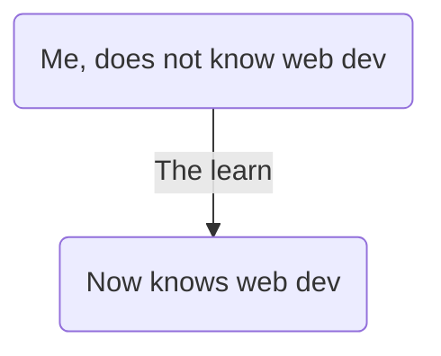

# fullstack-open
This was a course I took online about fullstack web development called FullStackOpen. I learned about React, NodeJS, Express, Axios, and more, to create simple web applications. 

```mermaid
    flowchart TB
        id1(Me, does not know web dev)
        id1-->|The learn|id2
        id2(Now knows web dev)

```
